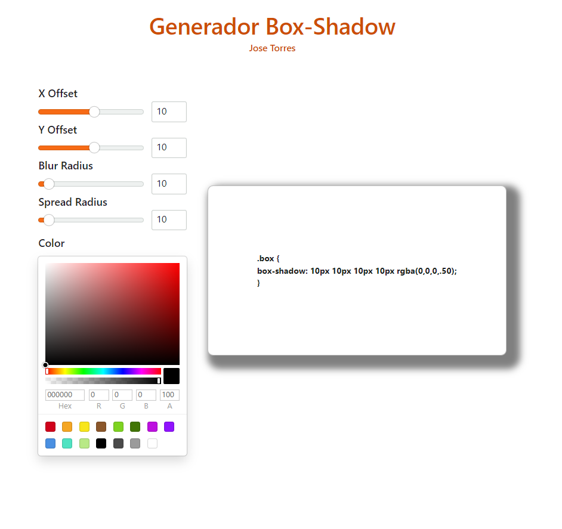

# Generador Box-Shadow

Una aplicación de frontend desarrollada con React y Vite que permite visualizar y generar propiedades `box-shadow` en tiempo real para aplicar en tus proyectos personales.

## Enlace a la Aplicación

Accede a la aplicación aquí: [CSS Box-Shadow Generator](https://tuappweb.com).

## Características

- **Visualización en tiempo real:** Configura los parámetros de `box-shadow` y visualiza instantáneamente el resultado.
- **Paleta de colores:** Selecciona colores para tus sombras usando el componente `uiw/react-color`.
- **Interfaz accesible:** Desarrollada con Radix UI para una experiencia de usuario accesible y agradable.

## Preview



## Uso

1. Accede a la página de la aplicación desde el enlace.
2. Configura las opciones de `box-shadow`, como el color, el desplazamiento, el desenfoque, y otros parámetros.
3. Copia el código CSS generado y pégalo directamente en tu proyecto para aplicar el efecto de sombra.

## Código del proyecto

1. Clona el repositorio:

   ```bash
   git clone https://github.com/tuusuario/css-box-shadow-generator.git
   ```
2. Navega al directorio del proyecto:

   ```bash
   cd css-box-shadow-generator
   ```
3. Instala las dependencias:

   ```bash
   npm install
   ```
4. Inicia la aplicación:

   ```bash
   npm run dev
   ```

## Uso

Configura los valores de `box-shadow` utilizando los controles de la app, como el selector de color y deslizadores para ajustar la posición y desenfoque. Puedes copiar el código CSS generado y aplicarlo directamente en tu proyecto.

## Funcionalidades Planeadas

### Próximas Funciones

1. **Botón de copiado:** Boton para copiar directamente el css sin tener que seleccionarlo.
2. **Modo oscuro:** Opción para cambiar entre tema claro y oscuro.
3. **Capacidad de añadir más capas de sombras:** Posibilidad de añadir múltiples capas de `box-shadow` en una misma vista.
4. **Templates predefinidos:** Plantillas de `box-shadow` por defecto para seleccionar configuraciones comunes de sombra.
5. **Guardar favoritos en LocalStorage:** Guarda tus configuraciones favoritas de `box-shadow` en el almacenamiento local del navegador.
6. **Botón de regreso al inicio para dispositivos móviles:** Un botón flotante en la vista móvil para regresar rápidamente al inicio de la página.
7. **Exportar tus favoritos:** Obten todos los templates de box shadow realizdos en un css único.
8. **Sombras en texto** Realiza todo lo anterior ahora con texto en lugar de cajas.

## Navegación y Contacto

## Tecnologías Utilizadas

- **React**: Biblioteca principal para la construcción de la interfaz de usuario.
- **Vite**: Empaquetador rápido y moderno para desarrollo con React.
- **Radix UI**: Componentes accesibles y de alto rendimiento.
- **uiw/react-color**: Selector de colores en React, para personalizar el color de la sombra.

## Contribuciones

Las contribuciones son bienvenidas. Si deseas agregar una nueva característica o corregir un error, por favor abre un _issue_ o envía un _pull request_.

## Licencia

Este proyecto está licenciado bajo la Licencia MIT. 

---
